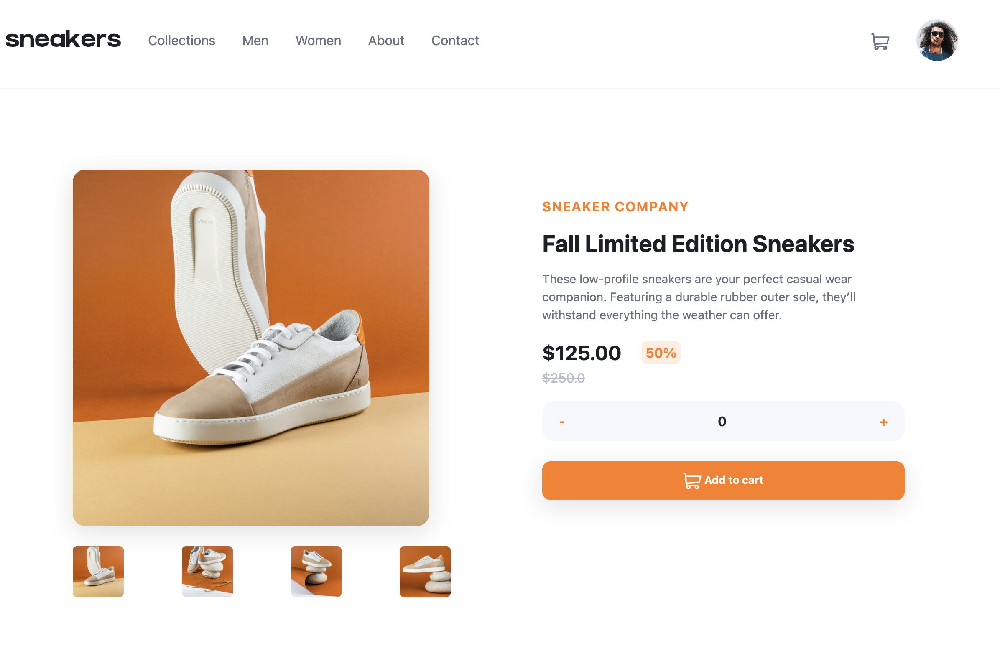
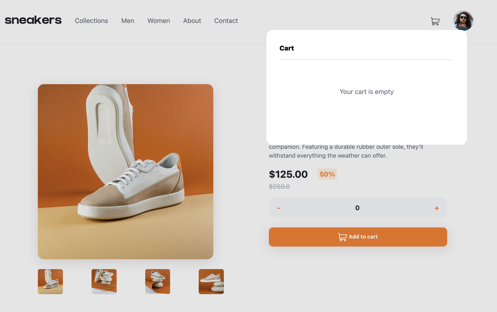
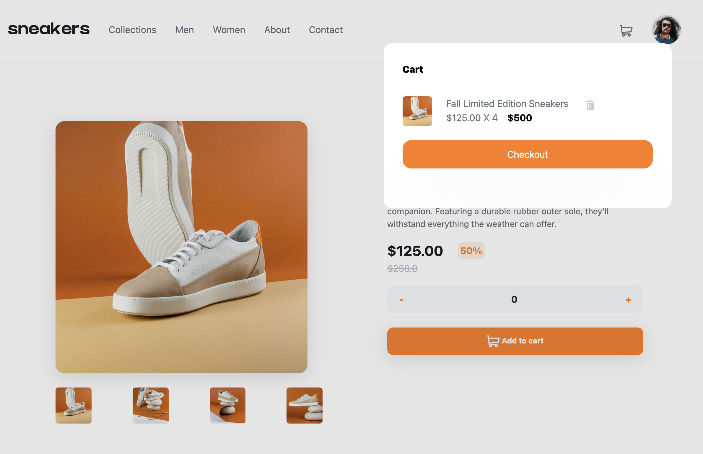
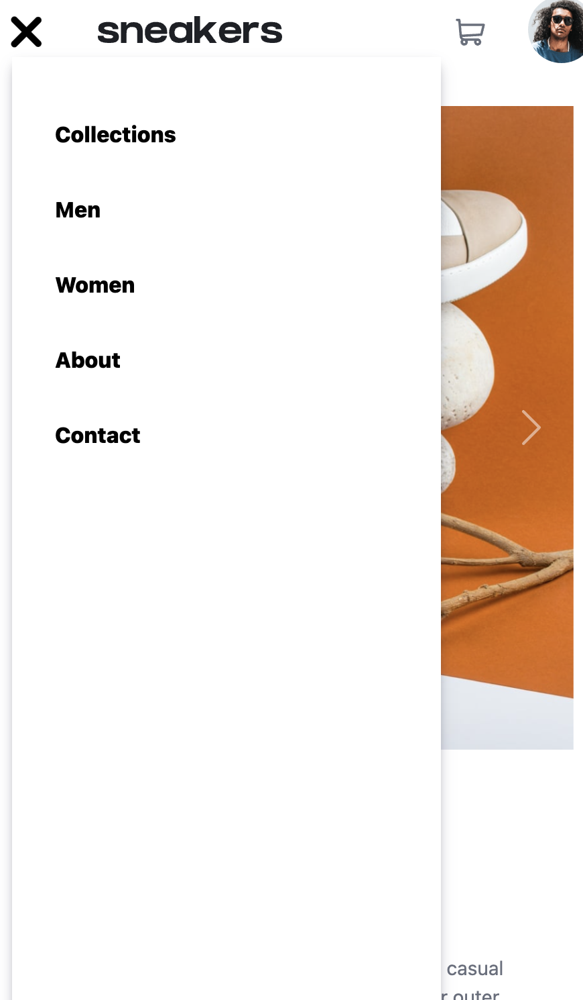
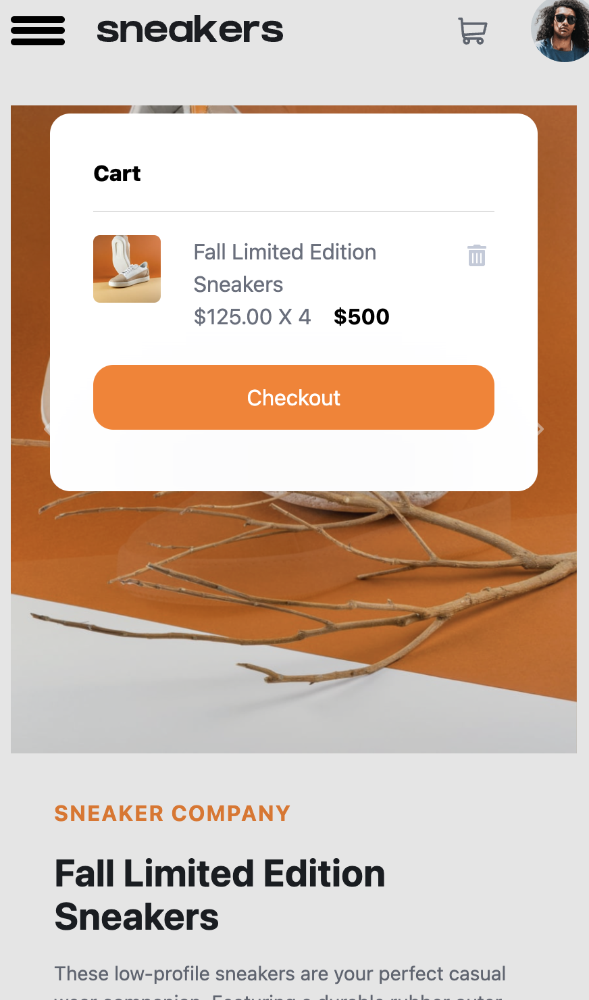

# Sneakers E-Commerce Page

Welcome to the Sneakers E-Commerce Page repository. This project is an interactive and responsive web page dedicated to showcasing and selling a variety of sneakers.

## Overview

### The Project

The aim of this project is to create an engaging and user-friendly e-commerce page specifically designed for showcasing and selling sneakers. The page features a clean and modern design to attract users and encourage them to explore the product offerings.

### Screenshots

**Desktop**

**Mobile**

### Features

- Responsive design for seamless user experience across devices.
- Product grid displaying a variety of sneakers.
- Detailed product pages with images, descriptions, and pricing.
- Shopping cart functionality for users to add and manage selected items.
- Secure checkout process for completing purchases.

### Built with

- HTML5
- CSS3 (Flexbox and Grid for layout)
- JavaScript (for interactive features)
- [Your Favorite E-Commerce Platform/API]

### What I Learned

This project provided a hands-on opportunity to enhance skills in creating a visually appealing and functional e-commerce website. Key takeaways include:

- Implementing responsive design to ensure a consistent experience on various devices.
- Utilizing CSS for layout and styling, including Flexbox and Grid for an organized and flexible structure.
- Incorporating JavaScript to add interactivity, such as dynamic product loading and cart management.

### Continued Development

In future iterations, I plan to:

- Integrate a backend system for handling user authentication and order processing.
- Enhance the user interface with animations and transitions.
- Implement additional features like user reviews and product recommendations.

### Useful Resources

- [MDN Web Docs](https://developer.mozilla.org/en-US/docs/Web) - Essential for HTML, CSS, and JavaScript documentation.
- [Your Favorite CSS Framework or Library]
- [Any APIs or libraries used]

## Author

- Divnoor Singh Nagra
